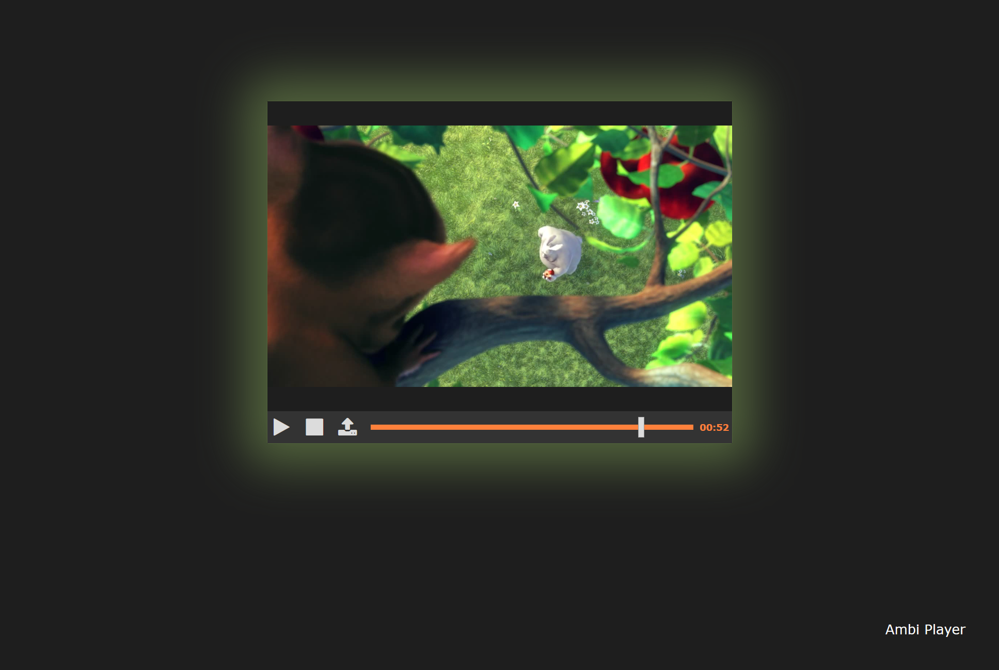

 
# AmbiPlayer

In dieser Demo erstellen Sie eine *Ambilight*- bzw. [*bias lighting*](https://en.wikipedia.org/wiki/Bias_lighting)-Funktion für Video-Elemente im Browser. Entwerfen und Implementieren Sie dazu eine *Library*, die beliebige DOM-Elemente mit einem farbigen *Glow*-Effekt umgibt. Das Setzen der Leuchtfarbe erfolgt über eine öffentliche Funktion, der entweder ein *String* ([CSS-Farbwert](https://developer.mozilla.org/en-US/docs/Web/CSS/color_value)), ein `Image`-Objekt oder ein `<video>`-Element übergeben wird. In den beiden letzten Fällen wird die Leuchtfarbe aus der Durchschnittsfarbe des Bildes bzw. des aktuellen Inhalts (*Frames*) des `<video>`-Elements bestimmt. Verwenden Sie die erstellte *Library*, um den vorhandenen *Video Player* mit einem *Ambilight* zu versehen, das sich während der Videowiedergabe dynamisch an dessen aktuellen Inhalt anpasst. 

## Aufbau der Anwendung und Ausgangslage

HTML- und CSS-Dateien der Anwendung sind vollständig vorgegeben. Das *User Interface* des *Video Players* wird im Element mit der ID `player`definiert. Dort befinden sich sowohl das für die Wiedergabe verwendete `<video>`-Element als auch die Schaltflächen zu dessen Steuerung bzw. zum Setzen der abzuspielenden Datei (`.controls`). 

Auch die grundlegende Funktionalität zum Import von Video-Dateien und dem Abspielen von Videomaterial ist über das Modul `VideoPlayer` im Unterordner `utils` gegeben. Der dort abgebildete Prototyp informiert registrierte *Observer* mittels `videoFrameChanged`-Event über Statusänderungen beim abgespielten Video.  Die Anwendung wird in der Datei `index.js` initialisiert. Konzentrieren Sie sich auf die Implementierung des *Ambilight* als wiederverwertbare Bibliothek, die die *bias lighting*-Funktion für beliebige HTML-Container bereit stellt.

**Videodateien für das Testen den Anwendung können Sie [hier](https://sample-videos.com/) herunterladen.**

Die fertige Anwendung soll in etwa so aussehen:

## Aufgabenstellung

Ihre Aufgabe ist die Implementierung eines *Library*-Moduls in der Datei `vendors/ambilight.js/index.js`, über das *Client*-Entwicklern und -Entwicklerinnen die *Ambilight*-Funktion bereit gestellt wird. Durch den Import des Moduls in die eigene Anwendung werden die folgenden Features integriert:

- Beliebige HTML-Elemente können zu *Ambilight*-Container gemacht werden. 

- Über eine Schnittstelle ist es möglich, diese Elemente mit einer farbigen *bias lighting*-Umrandung zu versehen. Dabei kann entweder ein CSS-kompatible Farbwert oder ein Videoelement übergeben werden. Bei der Übergabe eines Videoelements wird die Farbe auf Basis des aktuellen *Frames* berechnet.

Gehen Sie bei der Implementierung wie folgt vor:

1. Planen Sie die öffentliche Schnittstelle Ihrer Bibliothek: Wie sollen *Client*-Programmierer oder -Programmiererinnen die von Ihnen (dem *Implementor*) bereitgestellte Funktionalität verwenden? Wie augmentieren Sie ein vorhandenes DOM-Element mit dem durch die Bibliothek bereitgestellten *Ambilight*? Notieren Sie Ihre Überlegungen als Kommentare.

2. Erstellen Sie die äußere Schnittstelle der  Bibliothek und verknüpfen Sie diese mit dem Rest der Anwendung. Erweitern Sie dazu die den Initialisierungsprozess der Anwendung und verbinden Sie die vom `VideoPlayer` kommunizierten Statusveränderungen mit den Schnittstellen der Bibliothek.

3. Implementieren Sie die innere Funktionalität der Bibliothek. Beginnen Sie mit dem Übertrag des aktuellen Videobildes auf einen (versteckten) *Canvas* und der Bestimmung der aktuellen Durchschnittsfarbe.

## Starterpaket und Lösung

Ein vorbereitetes Starterpaket zur selbständigen Implementierung der Aufgabe sowie einen Lösungsvorschlag finden Sie auf [Github](https://github.com/Multimedia-Engineering-Regensburg-Demos/MME-AmbiPlayer). Die Lösung findet sich im `master`-Branch des verlinkten Repositories. Das Starterpaket im `starter`-Branch.