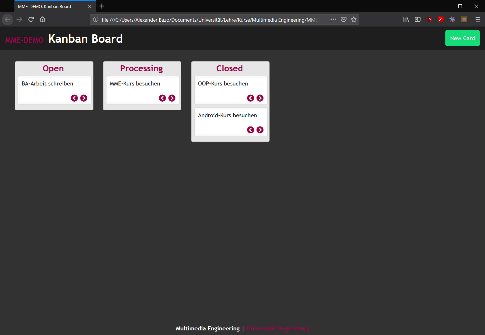

<a class="github-button button" href="https://github.com/Multimedia-Engineering-Regensburg-Demos/MME-Kanban-Board"></a> 
# Kanban-Board

Ein [Kanban Board](https://en.wikipedia.org/wiki/Kanban_board) ist ein, eigentlich physikalisches häufig jedoch auch digitales, Werkzeug zur Visualisierung und Dokumentation von Arbeitsprozessen. Das *Board* ist in mehrere Spalten aufgeteilt, die, von links nach rechts, fortschreitende Phasen in der Bearbeitung einer Aufgabe darstellen. Diese Aufgaben werden durch Karten repräsentiert, die im Laufe ihrer Bearbeitung von links nach rechts über das *Board* wandern. Der aktuelle Status der Aufgabe wird dabei durch die Position der jeweiligen Karte auf dem *Board* repräsentiert. *Kanban Boards* werden auch in der agilen Softwareentwicklung verwendet. Dabei werden durch die Karten z.B. einzelne Features der zu implementierende Software dargestellt. In dieser Demo entwickeln wir ein einfaches, browser-gestütztes *Kanban Board*, das über drei Spalten zur Darstellung *offener*, *aktuell bearbeiteter* und *abgeschlossener* Aufgaben verfügt.

!!! warning "Hinweis"
	Die Inhalte und Positionen der Karten werden nicht gespeichert. Die Anwendung ist daher nicht realistisch verwendbar. Eine einfache Lösung für dieses Problem ist die Verwendung der [Web Storage API](https://developer.mozilla.org/en-US/docs/Web/API/Web_Storage_API/Using_the_Web_Storage_API). Über diese Funktion können Sie Daten (Texte) dauerhaft im Browser speichern und beim nächsten Aufruf der Webseite bzw. Webanwendung verwenden.



## Aufbau der Anwendung
Alle Bestandteile der Anwendung werden durch DOM-Elemente dargestellt. Die Listen des *Boards* werden durch `ul`-Elemente mit der CSS-Klasse `list` repräsentiert. Der Name der Liste, bzw. der jeweilige Prozesschritte wird durch eine zusätzliche CSS-Klasse (`open`, `processing` und `closed`) definiert. Innerhalb der Liste werden einzelne Aufgaben durch `li`-Elemente dargestellt. Jedes dieser Elemente hat den folgenden Aufbau:

``` html
<li class="card" data-id="$ID">
	<textarea class="text">$TASK</textarea>
	<span class="icons">
		<i class="icon left fas fa-chevron-circle-left"></i>
		<i class="icon right fas fa-chevron-circle-right"></i>
	</span>
</li>
```

Für den Platzhalter `$ID` ist die eindeutige ID der jeweiligen Karte, für den Platzhalter `$TASK` der jeweilige Text einzufügen. Die Verwendung eines `<textarea>`-Elements erlaubt die gleichzeitige Darstellung und Manipulation des Textes. Mit Hilfe der eingebundene [Font Awesome](https://fontawesome.com/)-Bibliothek werden im `icons`-Container zwei Symbole zum Verschieben der Karte eine andere Liste eingefügt.

Im `header`-Bereich der Anwendung wird ein *Button* zum Erstellen einer neuen Karte dargestellt.

## Ausgangslage

Sowohl das HTML-Dokument (`index.html`) als auch die CSS-Dateien (`style.css` und `app.css`) sind vollständig vorgegeben. Für die Lösung der Aufgabenstellung ist nur die Bearbeitung der ebenfalls beigefügten *Javascript*-Dateien erforderlich. Die *Javascript*-Dateien werden bereits über das HTML-Dokument eingebunden. Beim Laden des Dokuments wird automatisch die `init`-Methode ausgeführt, die sich in der Datei `app.js` befindet. Diese Datei wird als Modul geladen und ausgeführt.

## Aufgabenstellung

1. Erweitern Sie den Prototyp (erstellt mit der `class`-Syntax) `Card` in der Datei/dem Modul `Card.js` . Er dient zur logische Repräsentation einer Karte. In den entsprechenden Objekten sollen eine ID (`Number`), ein Text (`String`) sowie der Name der Liste (`String`), in der die Karte aktuell abgelegt ist gespeichert werden. (`Card` wird aus dem Modul exportiert)

2. Erstellen Sie in der Datei/dem Modul `Board.js` einen Prototyp für die logische Repräsentation des *Boards*. Das *Board* speichert eine Liste aller Karten und erlaubt das Erstellen neuer, leerer Karten in der ersten Spalte (*Open*), das Aktualisieren von Kartentexten, sowie das Verschieben von Karten nach links bzw. rechts. Für die manipulativen Operationen der Karten werden dem *Board* jeweils die Karten-ID sowie die ggf. notwendigen, neuen Werte übergeben. Das *Board* ist ein *Observable* und sendet an geeigneter Stelle Informationen über neu erstellte oder verschobene Karten an registrierte *Observer*. (`Board` wird aus dem Modul exportiert)

3. Erstellen Sie in der Datei/dem Modul `BoardView.js` einen Prototyp, der als *View Controller* die Darstellung des *Boards* und die Interaktion des Nutzers mit den Karten realisiert. Dem *View* wird bei Erstellung das Elternelement (hier: `#board`) übergeben. Über eine Methode des Objekts kann eine als Parameter übergebene Karte im *UI* dargestellt bzw. aktualisiert werden. Der *View* fängt alle Interaktionen des Nutzers mit den dargestellten Karten ab und leitete diese über eine Implementierung des *Observer Pattern* an registrierte *Listener* weiter. (`BoardView` wird aus dem Modul exportiert)   

4. Verwenden Sie die Datei/dem MOdul `app.js` um die Anwendung zu initialisieren, die vorbereiteten Objekte zu erstellen und zwischen diesen zu vermitteln (*Events*). Importieren und verwenden Sie dazu `Board` und `BoardView`.

5. Überarbeiten Sie den Code und versuchen Sie funktionale Ähnlichkeiten, z.B. hinsichtlich der *Observable*-Tätigkeit von `Board` und `BoardView` aus den Modulen zu extrahieren, an zentralen Stelle zu definieren und über den `extends`-Mechanismus wieder in die jeweiligen Prototypen zu integrieren.

## Starterpaket und Lösung

Ein vorbereitetes Starterpaket zur selbständigen Implementierung der Aufgabe sowie einen Lösungsvorschlag finden Sie auf [Github](https://github.com/Multimedia-Engineering-Regensburg-Demos/MME-Kanban-Board). Die Lösung findet sich im `master`-Branch des verlinkten Repositories. Das Starterpaket im `starter`-Branch.
